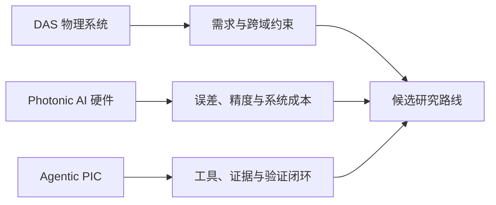

# 面向光子芯片智能设计的三方向技术调研

> **核心结论：** DAS、Photonic AI 与 Agentic PIC 均已出现真实芯片、系统或工具闭环进展，但从局部成功到可追溯、可比较、可制造的完整系统仍存在明显证据断点；本轮只提出候选路线，不确定最终研究方向。

状态：`TASK-007_REVIEW_READY（待验收）`｜证据截止：2026-09-21｜范围：正式报告、组会 PPT、证据核查与门户更新

## 5–10 分钟阅读路径

1. [正式技术调研报告](task-007-report.md)：六章正文，按原理、路线、代表工作、缺口和候选路线组织。
2. [核心全文证据审计](task-007-evidence-audit.md)：哪些结论读到正文，哪些仍是作者主张。
3. [候选研究路线](task-007-routes.md)：三条非最终路线与开放问题。
4. [引用与链接核查](task-007-citations.md)：DOI、arXiv、仓库和本地链接核验。
5. [检索与筛选记录](task-007-search.md)：检索式、范围、纳入/排除和停止规则。
6. [论文与项目出处索引](task-006-source-index.md)：32 篇论文和官方仓库入口。

## 三方向快照

| 方向 | 已实际做到 | 当前最大断点 | 本轮候选研究问题 |
|---|---|---|---|
| DAS 光电混合集成 | PIC/混合集成模块进入真实 DAS 实验 | 系统需求到器件、电路、封装和 DSP 的约束传播 | 可追溯 DAS 跨域约束图 |
| Photonic AI Computing | 真实芯片、任务和系统级演示 | 器件误差到任务精度和完整系统成本 | 误差—精度—成本联合证据链 |
| Agentic PIC Design | 结构化设计、真实 solver、自动评价等局部闭环 | 统一 Tool/RESULT/验证/失败恢复与制造级证据 | 证据优先的 PIC Agent Harness |

## 技术关系

!!! warning "证据边界"
    本项目没有运行仿真、benchmark、DRC/LVS 或物理实验。外部指标均为作者报告；公开代码不自动等于可复现；三条候选路线不是最终选题。

## 已验收研究档案

- [TASK-006 三方向路线收敛](task-006-overview.md)
- [TASK-005 核心架构深挖](review-package.md)
- TASK-004 候选池与对抗性审查保留在仓库 `references/task-004/`。
