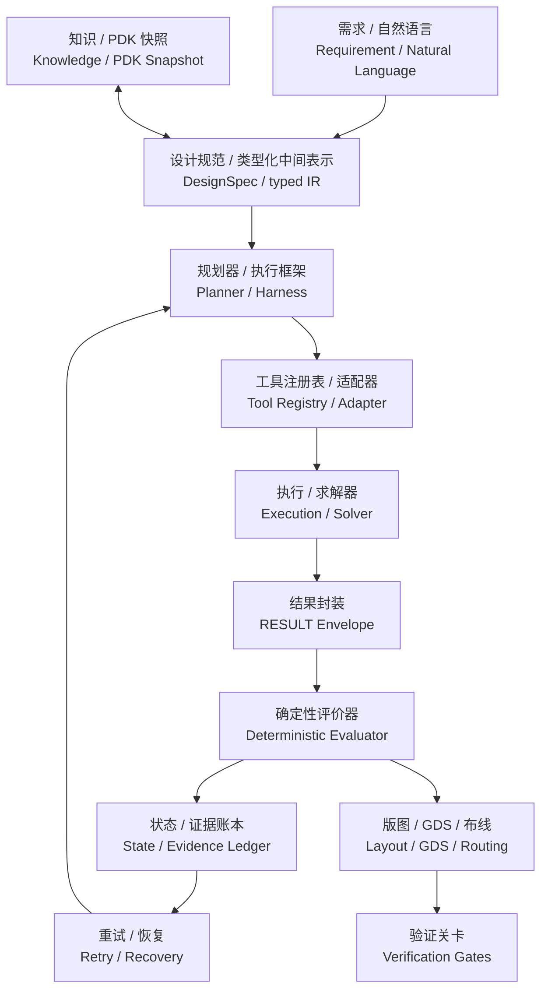

# 研究门户——TASK-005 核心架构深挖

> **一句话核心结论：**当前仍没有公开证据支持一个可直接采用、全开源、通用、可复现并达到 PIC 物理/制造可信闭环的智能体执行框架（Agent Harness）。

本门户是 `TASK-005A` 增加的本地人工阅读层，不新增研究判断。详细内容以 [`references/task-005/`](./review-package.md) 原 Markdown 为唯一事实源（Source of Truth）。

## 5–10 分钟阅读路径

1. 看下方两张矩阵，定位六个对象已经覆盖和仍然缺失的层级。
2. 查看 [参考架构 V0](#v0reference-architecture-v0)，理解建议的证据闭环。
3. 从 [研究缺口 → 切入点](#research-gap-entry-point) 进入五个候选切口。
4. 打开 [证据与来源](./source-log.md) 核查论文、仓库、提交（commit）与许可证。

## 关键技术地图

以下是 [技术层级地图（Technical Map）](./technical-map-and-objects.md) 的首页快照；详细证据和逐对象五问以原文为准。

| 技术层 | PhIDO / Agentic | AutoPhotonicDesign | gdsfactory + gplugins | PICBench | OpenROAD-MCP | MetaChat |
|---|---|---|---|---|---|---|
| 需求 / 自然语言（Requirement / Natural Language） | `已实现` | `部分实现` | `缺失` | `已实现` | `缺失` | `已实现` |
| 设计规范 / 类型化中间表示 / 领域语言（DesignSpec / typed IR / DSL） | `已实现` | `部分实现` | `部分实现` | `部分实现` | `部分实现` | `部分实现` |
| 智能体 / 执行框架 / 规划（Agent / Harness / Planning） | `部分实现` | `已实现` | `缺失` | `缺失` | `缺失` | `已实现` |
| 知识 / 检索增强 / 工艺设计套件（Knowledge / RAG / PDK） | `部分实现` | `部分实现` | `已实现` | `缺失` | `缺失` | `部分实现` |
| 工具调用（Tool Calling） | `已实现` | `部分实现` | `部分实现` | `部分实现` | `已实现` | `已实现` |
| 器件 / 电路设计（Device / Circuit Design） | `已实现` | `已实现` | `已实现` | `部分实现` | `缺失` | `已实现` |
| 物理仿真（Physical Simulation） | `部分实现` | `已实现` | `已实现` | `缺失` | `缺失` | `部分实现` |
| 优化 / 逆向设计（Optimization / Inverse Design） | `部分实现` | `已实现` | `部分实现` | `缺失` | `缺失` | `已实现` |
| 版图 / GDS / 布线（Layout / GDS / Routing） | `已实现` | `已实现` | `已实现` | `缺失` | `部分实现` | `部分实现` |
| 验证 / 设计规则检查 / 物理检查（Verification / DRC / Physical Checks） | `部分实现` | `部分实现` | `部分实现` | `部分实现` | `部分实现` | `部分实现` |
| 反馈 / 失败恢复（Feedback / Failure Recovery） | `部分实现` | `部分实现` | `缺失` | `部分实现` | `部分实现` | `部分实现` |

## 执行框架能力矩阵（Harness Capability Matrix）

`I` = `已实现（IMPLEMENTED）`，`P` = `部分实现（PARTIAL）`，`A` = `缺失（ABSENT）`，`U` = `不明确（UNCLEAR）`。完整限定见 [能力矩阵](./capability-and-verification-matrix.md)。

| 能力（Capability） | PhIDO / Agentic | AutoPhotonicDesign | gdsfactory + gplugins | PICBench | OpenROAD-MCP | MetaChat |
|---|---|---|---|---|---|---|
| 规范 / 中间表示（Spec / IR） | `I` | `P` | `P` | `P` | `P` | `P` |
| 知识（Knowledge） | `P` | `P` | `I` | `A` | `A` | `P` |
| 规划器（Planner） | `P` | `I` | `A` | `A` | `A` | `I` |
| 工具（Tool） | `I` | `P` | `P` | `P` | `I` | `I` |
| 仿真（Simulation） | `P` | `I` | `I` | `P` 电路级 | `A` PIC 仿真 | `P` 代理模型 |
| 结果封装（RESULT） | `P` | `P` | `P` | `P` | `I` 执行结果 | `P` |
| 评价器（Evaluator） | `P` | `I` | `P` | `I` | `P` 非 PIC | `P` |
| 重试（Retry） | `P` | `P` | `A` | `P` | `P` | `P` |
| 版图（Layout） | `I` | `I` | `I` | `A` | `P` 仅电子设计 | `P` 超表面 |
| 设计规则检查（DRC） | `P` | `P` | `P` | `A` | `P` 仅电子设计 | `A` |
| 版图与原理图一致性检查（LVS） | `A` | `A` | `P` 基础能力 | `A` | `P` 仅电子设计 | `A` |
| 签核（Signoff） | `A` | `A` | `A` | `A` | `U` 非 PIC | `A` |
| 基准测试（Benchmark） | `P` | `P` | `A` | `I` | `P` 工具测试 | `I` 邻近领域质量评价 |

## 参考架构 V0（Reference Architecture V0）

该图只是 [参考架构原文](./reference-architecture-v0.md) 的可视化，不增加新组件或结论。

核心边界：大语言模型（LLM）可以提出设计与行动，但不能签发物理通过结论；工具执行、结果封装（RESULT）、评价器（Evaluator）和每一级验证关卡（Verification Gate）必须分开记录。

## 研究缺口 → 切入点（Research Gap → Entry Point）

下表压缩自 [研究缺口矩阵（Research Gap Matrix）](./research-gaps-and-route-seeds.md)，详细的当前状态（Current State）、现有证据（Existing Evidence）、风险和更简替代均在原文。

| 缺口（Gap） | 当前断点 | 可能切入点 |
|---|---|---|
| 设计规范 / 类型化中间表示（DesignSpec / typed IR） | 需求追踪、单位、约束、验证义务未统一 | 最小类型化 PIC 规范 + 追踪 + 校验 |
| 工具适配器（Tool adapter） | PIC API 缺统一模式、权限、超时、成本和错误表示 | 少量任务级类型化适配器 + 查询/执行分离 |
| 结果 / 证据账本（RESULT / evidence ledger） | 无统一、不可变的科研结果封装 | RESULT V0 + 产物哈希 + 评价器来源记录 |
| 失败恢复（Failure recovery） | 失败分类、检查点、回滚和终止条件不完整 | 最小失败感知状态机 |
| 基准测试 / 验证（Benchmark / verification） | 缺版图/物理分层、预算公平和诚实验证上限 | 分层基准协议 + 分阶段验证关卡 |

## 5 个候选路线种子（Candidate Route Seeds）

当前只保留路线种子，不选择最终路线。完整格式见 [候选路线](./candidate-routes.md)。

1. **证据驱动的 PIC 执行框架（Evidence-grounded PIC Harness）**：类型化结果（typed RESULT）、证据账本、确定性评价器和有界状态机。
2. **类型化 PIC 设计规范与需求追踪（Typed PIC DesignSpec and requirement trace）**：比较类型化中间表示与直接 Python/YAML 的可测收益。
3. **智能体安全的 PIC 工具契约（Agent-safe PIC Tool Contract）**：查询/执行分权、类型化参数、资源预算和结构化错误。
4. **分层 PIC Agent 基准测试（Layered PIC Agent Benchmark）**：语法、连通性、电路、几何、DRC、全波仿真分层评价。
5. **失败感知的闭环仿真（Failure-aware simulation-in-the-loop）**：失败分类、检查点、重试策略和人工升级。

## 证据 / 来源日志（Evidence / Source Log）

- [证据与来源](./source-log.md)：检索词、论文/仓库、固定提交（commit）、许可证、源码证据和 Qwen 中间材料审计。
- [审查材料总览](./review-package.md)：TASK-005 审查包总览与证据边界。

!!! warning "阅读边界"
    `代码已核验（CODE VERIFIED）` 只表示实现可在固定提交源码中确认，不表示本机运行成功、物理正确、可制造或通过代工厂签核（foundry signoff）。
