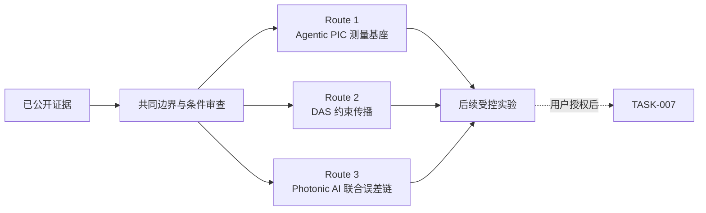

# TASK-006：三方向比较与候选路线收敛

> **核心结论：**当前优先级最高的是“小规模分层 Agentic PIC 评价基座 + 单一可证伪假设”；DAS 的 PIC-aware 系统预算与 Photonic AI 的器件误差—任务误差联合验证作为两条条件路线保留。

状态：`TASK-006_REVIEW_READY`｜阶段：研究路线收敛｜未启动 TASK-007

## 5–10 分钟阅读路径

1. [三方向技术地图](task-006-technical-map.md)：别人已经做到哪一层。
2. [跨方向比较](task-006-comparison.md)：研究价值、条件、风险与最小入口。
3. [候选研究路线](task-006-routes.md)：三条路线、最小实验和成败判据。
4. [条件与对抗性审查](task-006-critical-review.md)：必须确认的资源、反例和未决问题。
5. [证据与检索](task-006-evidence.md)：论文、DOI、检索词与证据边界。

## 三方向快照

| 方向 | 已实际做到 | 最值得研究的断点 | 当前判断 |
|---|---|---|---|
| DAS 光电混合集成 | 已有 SOI 收发 interrogator、高 ER EOM、微梳和混合集成激光进入真实 DAS | 器件指标到距离/分辨率/灵敏度/稳定性的可追溯链；完整 BOM 与公平 A/B | `CONDITIONAL` |
| Photonic AI Computing | 已有真实芯片、chiplet、封装和光电混合模型运行 | 工艺/热误差到任务精度；完整接口、控制、校准和墙插成本 | `CONDITIONAL` |
| Agentic PIC Design | 已有局部 Tool/Simulation/Layout/Benchmark 能力 | 分层评价、失败归因，以及 typed IR / adaptive calling 的因果收益 | `PREFERRED FOR MVP` |

## 候选路线

| 优先级 | 路线 | 最小验证 |
|---|---|---|
| 1 | 分层 Agentic PIC Benchmark + 一个可证伪假设 | 5–10 个 circuit tasks；先验证 evaluator，再做 typed spec 或 adaptive calling 等预算对照 |
| 2 | DAS PIC-aware link/noise budget | 用 3 组公开实验点校准器件—系统约束传播；有硬件后才做替换 A/B |
| 3 | Photonic AI 器件误差 → MVM → 任务精度 | 4×4 MZI 或 4/8 通道 MRR；比较 nominal、校准与鲁棒训练 |

## 技术关系

!!! warning "证据边界"
    本轮没有实现 Agent、benchmark 或 simulator，没有运行仿真、流片或物理实验。论文作者指标不是本项目实验结果；TASK-007 仍未启动。

## 已验收档案

- [TASK-005 架构深挖与 Reference Architecture V0](review-package.md)
- TASK-004 第一轮候选池保留在既有研究档案中。
