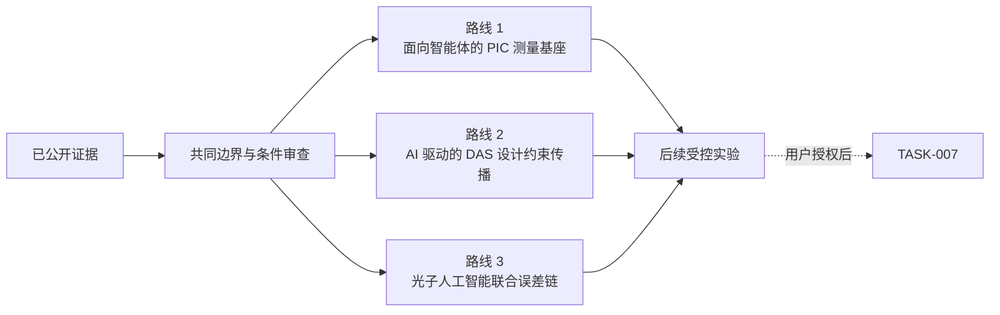

# TASK-006：三方向比较与候选路线收敛

> **核心结论：**当前优先级最高的是“小规模分层的面向智能体 PIC 评价基座 + 单一可证伪假设”；“DAS 光电混合集成 × 面向智能体的 PIC 设计”作为人工智能设计 DAS 芯片的交叉验证场景，光子人工智能计算的器件误差—任务误差联合验证作为扩展条件路线。

状态：`TASK-006_REVIEW_READY`｜阶段：研究路线收敛｜未启动 TASK-007

## 5–10 分钟阅读路径

1. [三方向技术地图](task-006-technical-map.md)：别人已经做到哪一层。
2. [DAS × 面向智能体的 PIC 设计](task-006-das-agentic.md)：人工智能如何设计 DAS 光电混合集成芯片，以及五组物理基线。
3. [光子人工智能计算项目](task-006-photonic-ai-projects.md)：十二个代表项目的逐项说明。
4. [面向智能体的 PIC 设计项目](task-006-agentic-projects.md)：七个代表项目和机制参照的逐项说明。
5. [跨方向比较](task-006-comparison.md)：研究价值、条件、风险与最小入口。
6. [候选研究路线](task-006-routes.md)：三条路线、最小实验和成败判据。
7. [条件与对抗性审查](task-006-critical-review.md)：必须确认的资源、反例和未决问题。
8. [证据与检索](task-006-evidence.md)：论文、DOI、检索词与证据边界。

## 三方向快照

| 方向 | 已实际做到 | 最值得研究的断点 | 当前判断 |
|---|---|---|---|
| DAS 光电混合集成 × 面向智能体的 PIC 设计 | 已有 DAS 光子芯片物理基线；尚无人工智能端到端设计并物理验证 DAS 芯片的公开证据 | DAS 需求到芯片/电子/封装约束、工具验证和失败修正的可追溯闭环 | `CONDITIONAL（条件成立后可行）` |
| 光子人工智能计算 | 已有真实芯片、芯粒、封装和光电混合模型运行 | 工艺/热误差到任务精度；完整接口、控制、校准和墙插成本 | `CONDITIONAL（条件成立后可行）` |
| 面向智能体的 PIC 设计通用方法 | 已有局部工具、仿真、版图和基准能力 | 分层评价、失败归因，以及类型化设计表示/自适应工具调用的因果收益 | `PREFERRED FOR MVP（最小验证优先）` |

## 候选路线

| 优先级 | 路线 | 最小验证 |
|---|---|---|
| 1 | 分层的面向智能体 PIC 基准 + 一个可证伪假设 | 5–10 个电路任务；先验证评价器，再做类型化设计规格或自适应工具调用的等预算对照 |
| 2 | 人工智能驱动的 DAS 光电混合集成设计约束传播 | 固定一个 DAS 子系统，比较人工、固定规则、无工具语言模型和工具型智能体 |
| 3 | 光子人工智能器件误差 → 矩阵运算 → 任务精度 | 4×4 马赫-曾德尔干涉仪或 4/8 通道微环；比较标称、校准与鲁棒训练 |

## 技术关系

!!! warning "证据边界"
    本轮没有实现 Agent、benchmark 或 simulator，没有运行仿真、流片或物理实验。论文作者指标不是本项目实验结果；TASK-007 仍未启动。

## 已验收档案

- [TASK-005 架构深挖与 Reference Architecture V0](review-package.md)
- TASK-004 第一轮候选池保留在既有研究档案中。
