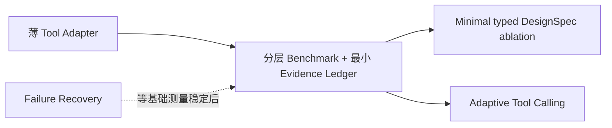

# 跨方向与内部比较

## 跨方向矩阵

| 维度 | DAS 光电混合集成 | Photonic AI Computing | Agentic PIC Design |
|---|---|---|---|
| 核心科研对象 | 传感系统需求如何映射到 PIC 收发与相干链路 | 器件/架构误差、接口成本如何影响 AI 任务 | 模型、工具、表示与验证如何形成可测闭环 |
| 公开硬件成熟度 | 已有 2–49 km 端到端集成实验，完整系统仍混合 | 已有真实模型与光电混合系统，少数达到封装/软件栈层 | 主要是软件原型、局部闭环与 benchmark |
| 最小可验证入口 | PIC-aware link/noise budget；器件替换 A/B | 小型 MZI/MRR 的误差—MVM—任务联合验证 | 5–10 个任务的分层 evaluator + trace/RESULT |
| 与已知软件条件匹配 | 中：可先做 MATLAB/Python/Lumerical 模型 | 中高：可先做器件/紧凑模型与任务联合仿真 | 高：Python/gdsfactory/SAX/KLayout 可形成低成本基座 |
| 硬件门槛 | 高：窄线宽激光、EDFA、环行器、采集、光纤与封装 | 很高：PIC/EIC、封装、高速 I/O、校准和软件栈 | 低—中：主要是可重复软件环境；高层物理验证仍需求解器/PDK |
| 主要可发表缺口 | 器件指标到系统指标的可追溯设计规则与公平 A/B | 工艺/热误差到任务精度和完整能耗的统一链条 | 表示/工具策略是否真正提高正确率、成本和故障可诊断性 |
| 最大证据风险 | 把子模块或通信 PIC 当完整 DAS | 把核心 TOPS/W、投影值当墙插系统优势 | 把 schema/wrapper/日志工程包装成科研贡献 |
| 当前可行性判断 | `CONDITIONAL` | `CONDITIONAL` | `PREFERRED FOR MINIMUM VALIDATION` |

## Agentic PIC 内部切入点

| 切入点 | Research Gap | 最小实验 | 成功信号 | Strongest counterexample | 定位 |
|---|---|---|---|---|---|
| Layered Benchmark + Evidence Ledger | 失败层级、预算和证据不可比 | 5–10 个固定 circuit tasks；已知 valid/invalid artifacts；syntax/connectivity/SAX/geometry/DRC 分层 | evaluator 的检出率/误报率可测，运行可重放、失败可定位 | 小任务可能只测 evaluator compliance；普通 JSON/日志/Git 也许已足够 | **基础路线** |
| Minimal typed DesignSpec | typed IR 的收益未经因果验证 | 同模型/任务/预算，对比 direct Python/YAML 与最小 typed envelope | 约束遗漏、修复轮数或无效调用显著下降，且成本可接受 | AutoPhotonicDesign 类窄任务可用 Python/files 完成；schema 可能只增负担 | **路线 1 上的假设** |
| Adaptive tool calling | uncertainty 是否能预测必要工具调用未知 | no-tool / fixed-access / adaptive-access 等预算对照 | 保持正确率同时减少冗余调用，且不增加漏调用 | 固定风险分层可能同样有效；自报置信度可能无预测力 | **高风险假设** |
| Tool adapter | PIC 工具契约不统一 | 对非法参数、超时、缺依赖和工具错误做 fault injection | 边界拦截与错误分类提升，副作用受控 | typed Python function 足够；MCP/wrapper 本身不是贡献 | 薄基础设施 |
| RESULT / ledger | 现有输出不可统一复核 | 对故障运行做 replay，比较普通日志与最小 envelope | 缺失条件发现率、复核一致性或定位时间改善 | 复杂 schema 维护成本大于收益 | 并入基础路线 |
| Failure recovery | blind retry 与分类恢复收益未知 | fail-fast / blind retry / classified recovery 对照 | 恢复率提高且错误接受率不升 | 人工注入故障不代表真实分布 | 后续扩展 |

## 收敛关系

`INFERENCE`：这些不是六条平行主线。Benchmark/ledger 是共同测量基座；typed DesignSpec 与 adaptive tool calling 是两个可证伪假设；adapter 是必要但应最薄的基础设施。
