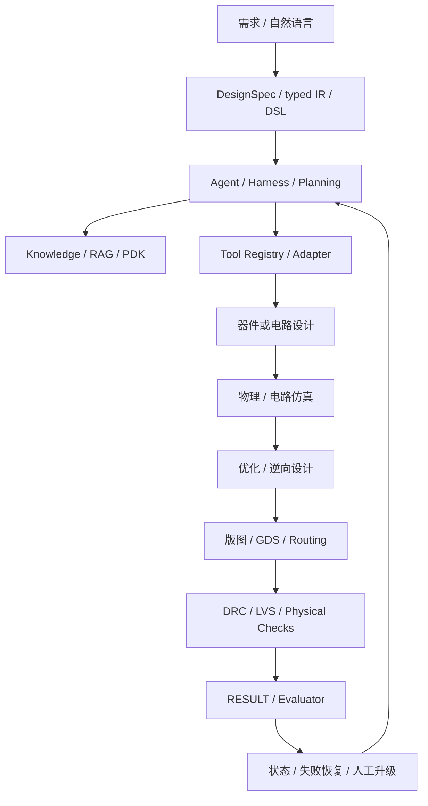
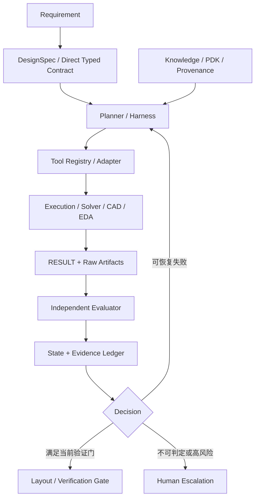

# 面向光子芯片智能设计的三方向技术调研

## DAS 光电混合集成、光子人工智能计算与 Agentic PIC Design

**项目**：PIC_Harness_Research  
**任务**：TASK-007｜正式调研报告与组会汇报  
**版本**：V0.9（待 GPT / 用户审查）  
**证据截止**：2026-09-21

---

## 摘要

本报告围绕三个层次递进、但不能相互替代的课题目标展开：第一，人工智能辅助设计一款分布式声学传感（Distributed Acoustic Sensing，DAS）光电混合集成芯片并贯通设计流程；第二，将人工智能推理计算映射到光子硬件；第三，建立能够调用设计、仿真、优化和验证工具的光子芯片设计 Agent Harness。报告综合 TASK-004 至 TASK-006 的已验收成果，并对影响路线判断的代表论文、公开代码和官方资料进行了定向全文核证。

调研显示，DAS 方向已经有硅光集成收发前端、高消光比调制器、微梳并行传感和 InP–SOI 混合集成窄线宽激光模块进入真实系统实验，但激光、放大、环行、电子采集、数字信号处理、封装与长期稳定性仍常以片外或未充分报告的形式存在。当前未发现公开证据证明人工智能 Agent 已端到端设计并物理验证一款 DAS 光电混合集成芯片。光子人工智能计算已经从核心算子演示发展到真实模型或任务的芯片/系统实验，涵盖干涉网格、微环/波分/微梳和衍射架构；然而，器件误差、校准、激光、光电转换、控制、存储和数据移动的边界并不统一，核心 TOPS/W 不能直接等同完整系统优势。Agentic PIC Design 则已出现自然语言到结构化电路、脚本生成、真实仿真在环、自动评价和工具适配等局部闭环，但没有一套公开、可复现的系统同时覆盖可靠需求表示、确定性工具调用、器件/电路仿真、版图、DRC/LVS、PDK 合规、失败恢复和 foundry signoff。

因此，本报告不预设最终方向，而提出三条供进一步讨论的候选路线：证据优先的 Agentic PIC Harness 方法研究；DAS 系统需求到光电混合集成约束的可追溯传播；光子 AI 的器件误差—任务精度—系统成本联合证据链。三者的共同核心不是“让 LLM 多生成代码”，而是建立明确的系统边界、确定性工具证据、分层验证和诚实的结论强度。

**关键词**：光子集成电路；分布式声学传感；光电混合集成；光子人工智能；Agent Harness；仿真在环；设计验证；证据追溯

---

# 第一章 研究背景、问题范围与方法

## 1.1 三层课题目标

程教授提出的三个目标对应不同的研究对象和成功含义。

| 层级 | 目标 | 核心对象 | 当前报告回答的问题 |
|---|---|---|---|
| 保底目标 | AI 设计 DAS 光电混合集成芯片并跑通流程 | 传感系统、PIC、电子、封装、设计工具 | 哪些物理子系统已有实验基础，需求到设计之间还缺什么？ |
| 中等目标 | 将 AI 推理计算集成到光芯片 | 光学线性核、非线性、存储、控制、光电转换 | 哪些架构已到芯片/系统级，性能数字的边界是什么？ |
| 最高目标 | 建立通用光芯片设计 Agent Harness | LLM、状态、知识、工具、求解器、评价器、证据与恢复 | 哪些闭环能力已经出现，哪些仍未解决或不可复现？ |

三个目标存在技术联系，但不能用其中一个替代另一个：DAS 芯片是具体物理系统，不因有 Agent 就自动可设计；光子 AI 芯片是在光学域执行计算，不等于“用 AI 设计光芯片”；Agent Harness 是设计方法和执行框架，不是某一光子器件的性能结果。

## 1.2 研究问题

本报告集中回答四组问题：

1. 三个领域各自有哪些主要技术路线，代表工作实际达到了器件、芯片、模块还是系统层？
2. 哪些结论由论文/代码直接支持，哪些只是作者主张或本项目推论？
3. 当前关键缺口位于器件性能、跨域约束、工具闭环、验证证据还是系统边界？
4. 在不预设最终方向的前提下，哪些研究问题值得继续讨论？

## 1.3 方法与证据规则

本轮采用定向范围综述：以 TASK-004 至 TASK-006 候选池为基础，对会改变路线判断的对象补充全文核读和一手来源核验。检索式、筛选规则和停止规则见[检索与筛选记录](/task-007-search.html)，关键正文核证见[全文证据审计](/task-007-evidence-audit.html)，统一术语见[术语表](/task-007-terms.html)。本报告不是穷尽式系统综述，不宣称覆盖所有论文。

材料规模包括 TASK-004 的 20 个 Agentic PIC/Harness 候选、TASK-005 的 6 个核心架构对象，以及 TASK-006 按 DAS 8、光子 AI 12、Agentic PIC/方法 12 形成的 32 篇论文索引。由于这些集合的研究问题和对象类型不同，本报告不把它们伪装为一条 PRISMA 筛选漏斗。

全文使用五类标签：`FACT`、`AUTHOR CLAIM`、`CODE VERIFIED`、`INFERENCE` 和 `UNKNOWN`。论文中的指标均属于作者报告，除非另有说明，本项目没有复算、运行或物理复现。对抗性审查主要采用三条原则：寻找最强反例；检查隐藏系统边界；把“工具运行”“物理正确”和“制造签核”分层。

## 1.4 共同验证层级

```text
语法有效
↓
几何有效
↓
DRC
↓
电路级仿真
↓
全波仿真
↓
LVS / 连接一致性
↓
PDK 合规
↓
工艺角 / 鲁棒性
↓
Foundry Signoff
↓
流片与系统实验
```

这些层级不可互换。生成 GDS 只证明有版图文件；DRC clean 只证明在给定规则下通过几何检查；调用 FDTD 只证明求解器执行；foundry signoff 和实物系统性能需要更强、不同类型的证据。

---

# 第二章 DAS 光电混合集成芯片研究现状

## 2.1 DAS 原理与系统链路

DAS 通常把相干光注入传感光纤，利用沿线瑞利后向散射的相位变化恢复位置相关的动态应变或振动。系统性能不是单一器件决定，而是以下链路共同作用：

```text
窄线宽光源
→ 脉冲/扫频调制与放大
→ 环行/耦合进入传感光纤
→ 后向散射与本振光
→ 偏振处理与相干接收
→ 光电探测、TIA、ADC
→ 数字解调、滤波与事件分析
```

距离受相干性、光纤损耗、放大与接收噪声影响；空间分辨率与脉冲宽度或扫频带宽相关；应变灵敏度受相位噪声、相对强度噪声、接收动态范围、标距、带宽与统计定义共同影响。因而，将不同论文的“最佳距离”“最佳灵敏度”和“最佳分辨率”拼成同一设计目标并不严谨。

## 2.2 集成层级必须分开

| 集成层级 | 典型内容 | 能证明什么 | 不能证明什么 |
|---|---|---|---|
| 单器件 | 调制器、探测器、激光、微环 | 某器件在给定条件下的性能 | 完整收发或 DAS 系统已集成 |
| PIC | 调制、分光、偏振、混频、探测与波导互连 | 光学前端可在芯片上协同工作 | 光源、驱动、ADC、DSP 和封装都已闭合 |
| 光电混合模块 | PIC + 激光/电子/微光学/TEC/封装 | 模块级接口与部分系统功能 | 外部放大、环行、数据采集和长期现场可靠性已解决 |
| 完整 DAS 系统 | 光源到解调输出的真实光纤实验 | 在给定实验条件下的系统性能 | 未测试工况、量产良率或不同工艺下的普遍性能 |

## 2.3 主要技术路线与代表进展

### 2.3.1 SOI 集成相干收发前端

[Jin 等 2024](https://doi.org/10.1364/PRJ.512298) 将马赫–曾德尔调制、偏振旋转分束、两组 90° 光学混合和多路平衡探测集成于 SOI 芯片，并进入 12.1 km 与 49 km DAS 实验。`FACT`：PIC 已经进入端到端传感链路。`AUTHOR CLAIM`：具体距离、分辨率和灵敏度来自论文。其边界同样明确：窄线宽激光、放大、环行、采集与 DSP 仍在片外。因此更准确的表述是“集成 DAS 光学收发前端”，不是“完整 DAS 系统片上化”。

### 2.3.2 InP–SOI 混合集成光源与收发 PIC

[Jin 等 OFC 2026](https://doi.org/10.1364/OFC.2026.W4D.2) 进一步把线宽低于 3 kHz 的 InP 外腔激光经两枚微透镜和微型隔离器连接至 SOI 收发 PIC，模块约 40 mm × 40 mm × 10 mm，并带 TEC。作者在 10 km G.652.D 光纤上报告约 4 m 空间分辨率和 73.27 pε/√Hz 的特定统计口径应变分辨率。该结果证明混合集成模块进入真实 DAS 演示，但三页会议短文未提供制造良率、完整功耗/成本、长期漂移、重复样本或开放原始数据；EDFA、环行器、AWG、TIA、DAQ 与离线 DSP 仍外置。它不能与 2024 工作在不同距离、分辨率和统计定义下直接用单一数字比较优劣。

### 2.3.3 高消光比片上调制

[Cheng 等 2023](https://doi.org/10.1038/s41467-023-43244-9) 采用多微环耦合结构实现高消光比硅基电光调制器。论文正文报告静态 71 dB、self-heterodyne 动态 68 dB，多个通道超过 65 dB，并将器件放入 2 km DAS 台架对照。其贡献位于发射调制子模块；谐振器的温度/工艺敏感性、插损、驱动和频移能力仍需纳入系统设计。不能从“高 ER 器件进入 DAS”外推“完整解调器或系统已集成”。

### 2.3.4 通信相干 PIC 复用

[Sandmann 等 2023](https://arxiv.org/abs/2306.04199) 探索复用通信相干收发芯片进行声学传感。此路线利用成熟的双偏振 IQ 调制/接收和探测电子，但通信系统的高带宽并不自动满足 DAS 所需的低相位噪声、高动态范围、低漂移和长相干要求。它提示一个重要研究问题：AI 设计不能只做元件拼接，而应识别“可复用参数”和“必须重设计的传感特定约束”。

### 2.3.5 微梳并行与混合集成稳频光源

[双微梳并行 DAS](https://doi.org/10.1126/sciadv.adf8666) 使用两个 SiN 微环形成多波长并行探测，作者在 10 km、5 m 空间分辨率条件下报告 560 fε/√Hz@1 kHz，并讨论不采用分布式放大时的距离扩展。它说明集成微梳可提高通道并行性和相干累加能力，但外腔激光、泵浦、控制、探测与 DSP 仍造成明显系统复杂度。[Idjadi 等 2025](https://doi.org/10.1364/OFC.2025.Tu2K.5) 的混合集成双波长激光进入 37 km φ-OFDR，则进一步说明低噪声光源与稳频/封装可成为独立关键路径。

## 2.4 当前难点

1. **跨域约束传播。** 距离、分辨率和灵敏度必须转化为激光线宽、调制波形、损耗、接收噪声、ADC 有效位数、DSP 和封装稳定性要求。
2. **系统边界。** 把激光或 PIC 纳入模块并不等于 EDFA、环行、电子和算法全部闭合。
3. **指标可比性。** 距离、标距、频率、带宽、噪声谱密度和统计方法不同，单一数字排名容易失真。
4. **长期稳定性。** 微环、干涉仪、激光耦合与偏振通道受到温度、工艺和环境漂移影响。
5. **封装与制造。** 耦合容差、热管理、微光学、电子接口、良率和重复性常比版图生成更接近工程瓶颈。

## 2.5 AI 设计的覆盖范围与缺口

`UNKNOWN`：当前未找到 Agent 端到端设计并物理验证 DAS 光电混合集成芯片的公开证据。已有 Agentic PIC 工作可提供需求结构化、工具调用和证据记录方法，但 DAS 的系统预算、器件/电子/封装接口和真实 PDK 数据仍需独立建立。最重要的研究缺口不是“让模型生成一个 GDS”，而是让每个系统需求能够追溯到器件、电路、封装和验证证据，并在证据不足时明确升级到人工判断。

---

# 第三章 Photonic AI Computing 研究现状

## 3.1 基本计算链

光子计算利用干涉、传播、波分复用和探测执行矩阵—向量乘法、卷积、相关或优化等计算。大多数系统仍是光电混合的：光学域擅长高并行线性运算，电子域负责数据加载、权重配置、非线性、存储、控制和误差校准。

```text
电子输入 / 编码
→ 电光调制
→ 光学线性算子
→ 光电探测
→ 电子非线性 / 归一化 / 存储 / 控制
→ 下一层或任务输出
```

判断“AI 已在光芯片上运行”时，应区分理论映射、数值仿真、芯片核心实验、任务级推理演示和完整系统边界。

## 3.2 干涉型与相干网格

MZI 网格可分解并实现矩阵变换，优势是相位可编程与通用线性代数表达；代价是相位稳定、插损、校准和控制复杂度随规模上升。[Ashtiani 等 2022](https://doi.org/10.1038/s41586-022-04714-0) 展示片上光子深度神经网络及非线性，证明端到端网络不再只停留在线性核；但任务规模、外部控制和整体能耗仍需要与器件级指标分开。

[PACE 2025](https://doi.org/10.1038/s41586-025-08786-6) 采用 2.5D PIC/EIC 集成，包含 64×64 光学 MAC 和超过 16,000 个光子器件，展示大规模光电混合计算引擎。正文证据显示其使用外部激光并以启发式 Ising 问题为主要应用，不是通用 DNN 推理系统。PACE 的价值在于规模化封装、控制和计算阵列，而不是证明所有 AI 任务都获得同样优势。

[通用光子 AI 加速器原型 2025](https://doi.org/10.1038/s41586-025-08854-x) 展示了多类真实模型与任务，并公开代码/数据，是从光学核心向软硬件系统推进的重要证据。与此同时，不同任务的精度损失并不相同，说明“光子算子可运行”与“模型精度可接受”之间仍有任务相关的误差传播问题。

## 3.3 微环、波分复用与微梳

微环谐振器可在 WDM 通道上实现权重、调制或滤波，微梳提供大量相干波长载波。该路线具有通道并行和面积优势，但谐振波长对工艺和温度敏感，需要热调谐、标定与反馈。

[Xu 等 2021](https://doi.org/10.1038/s41586-020-03063-0) 的微梳卷积加速器和 [Bai 等 2023](https://doi.org/10.1038/s41467-022-35506-9) 的微梳+MRR 光子处理单元展示高并行卷积/矩阵运算；其系统仍包含片外或电子数据链，原型实际功耗与未来高集成投影必须分开。[Netcast 2022](https://doi.org/10.1126/science.abq8271) 将模型权重通过光网络送到边缘光子客户端，证明分布式推理架构的可行性；常被引用的 40 aJ 是接收端每次乘法的光能口径，不是包含激光、网络、调制、电子和控制的墙插总能耗。

[Feldmann 等 2021](https://doi.org/10.1038/s41586-020-03070-1) 的相变材料张量核以非易失权重降低持续调谐需求，但写入能耗、器件漂移、状态精度和外围控制仍影响完整系统。

## 3.4 衍射、自由空间与片上衍射

衍射型系统通过传播与相位/振幅调制实现线性变换，具备大规模并行性，但通常任务专用，且受到对准、可重构性、非线性和输入输出接口限制。[Zhou 等 2021](https://doi.org/10.1038/s41566-021-00796-w) 展示可重构衍射处理器，但其自由空间形态不属于 PIC。[ACCEL 2023](https://doi.org/10.1038/s41586-023-06558-8) 形成全模拟光电视觉系统并运行真实任务；其 operation 口径和任务专用结构不能与数字 MAC 简单等同。[片上可训练衍射网络 2024](https://doi.org/10.1038/s41467-024-50677-3) 推进了片上原位训练，但输入预处理、FPGA、TEC 与热控制仍属于系统成本。

[Taichi 2024](https://doi.org/10.1126/science.adl1203) 采用光子芯粒扩展计算规模，是模块化扩展的重要代表。论文对“AGI”的定位属于作者表述，不是已经验证通用智能。类似地，[百层光子深度学习 2025](https://doi.org/10.1038/s41467-025-65356-0) 的深层模型映射依赖物理层复用与外部控制，不能表述为数百层全部物理集成在单片上。

## 3.5 评价光子 AI 的共同维度

| 维度 | 必须报告的问题 | 常见误读 |
|---|---|---|
| 任务 | 模型、数据集、规模、训练/推理阶段 | 小型分类成功 = 通用 AI 成熟 |
| 精度 | 数值精度、噪声、校准、任务准确率损失 | 只报核心算子误差，不报模型影响 |
| 吞吐 | operation 定义、并行度、时钟和利用率 | 把光学传播速度当持续吞吐 |
| 能耗 | 激光、DAC/ADC、驱动、探测、控制、温控、存储 | 核心 aJ/op 或 TOPS/W = 墙插系统能效 |
| 可扩展性 | 插损、串扰、相位/谐振漂移、校准与封装 | 线性核阵列变大 = 系统可无限扩展 |
| 可编程性 | 权重更新、支持算子、非线性和编译 | 单一固定任务 = 通用加速器 |
| 制造性 | 工艺容差、良率、重复性与长期稳定 | 单颗芯片演示 = 可量产 |

## 3.6 与 DAS 的可能联系

两者都依赖相干光源、调制、光电探测、混合集成、校准和高速信号处理。光子计算可潜在承担 DAS 的相关、滤波、波束形成或事件识别；DAS 又为光电混合计算提供长链路、噪声与实时性场景。然而，这种联系目前主要是技术组件和问题结构的相似性。`INFERENCE`：在没有同一系统边界和任务证据前，不能声称某个光子 AI 加速器已适合 DAS，也不能把 DAS PIC 直接视为 AI 推理芯片。

## 3.7 研究缺口

当前最值得重视的缺口是器件误差、光学算子误差、网络层误差、任务精度和完整系统成本之间缺少统一可追溯链。只有在同一任务、同一精度目标和明确能耗边界下，才能判断某种光子架构相对电子或其他光子路线的净优势。

---

# 第四章 Agentic PIC Design 与 Agent Harness

## 4.1 技术层级地图



该地图是一种分析框架，不代表任何现有项目已经完整实现全部层级。

## 4.2 代表系统的实际能力

### 4.2.1 PhIDO / PhIDO-Agentic

[PhIDO](https://doi.org/10.1063/5.0300741) 使用语言模型把自然语言解析为实体、规格和 YAML DSL，经 Pydantic 校验后生成 gdsfactory 版图、运行 DRC，并在合适任务上使用 SAX 电路模型。论文评估 102 个 prompt；作者报告单器件成功率最高约 91%，≤15 元件电路 pass@5 约 57%。正文同时明确这是 proof-of-concept，主要证明结构有效性而非器件/电路性能达标。FDTD 分支因版本兼容未进入主发布，公开基准的路由规模和 PDK 也有限。

`CODE VERIFIED`：固定提交可见结构化 schema、工具编排和部分设计/验证代码。`INFERENCE`：它是目前最接近 PIC 专用 Harness 骨架的开源项目之一，但仍不是 foundry-ready 自动设计系统。

PhIDO-Agentic 延伸了工具调用与多步执行，但无独立同行评审论文。其仓库可作为代码机制证据，不能替代方法与实验评价。

### 4.2.2 AutoPhotonicDesign

[AutoPhotonicDesign](https://arxiv.org/abs/2606.00915) 展示商业编程智能体围绕真实物理求解器执行 propose → simulate → evaluate → iterate 循环，覆盖器件逆向设计和多物理问题。它是“simulation-in-the-loop”强证据，因为 solver 输出确实驱动下一轮设计。

但工程师需要提供目标、约束、初始脚本和评价器；MZM 示例还需要专家纠正模式识别和 junction shunt 重复计算。由此应把其能力表述为“在人类配置和纠错后可自治迭代”，而不是无条件的自然语言端到端设计。其依赖商业工具/编程智能体也限制完全复现。

### 4.2.3 gdsfactory + gplugins

[gdsfactory](https://github.com/gdsfactory/gdsfactory) 与 [gplugins](https://github.com/gdsfactory/gplugins) 提供 PCell、版图、路由、PDK 接口、紧凑模型和多求解器适配。它们是高价值 Tool Layer，不是 Agent 研究本身。可复用价值在于确定性 API、文件产物和与专业工具连接；Agent 仍需额外负责参数验证、会话、权限、状态、证据和失败处理。

### 4.2.4 PICBench

[PICBench](https://arxiv.org/abs/2502.03159) 包含 24 个 PIC 电路问题，要求从自然语言生成 JSON netlist，以人工 golden design 和 SAX 紧凑模型进行语法/功能评价，并提供有限反馈重试。它建立了自动判定和 pass@k 类评价入口，但最高证据层是电路级紧凑模型：没有证明全波、GDS、DRC、LVS、PDK 或制造有效性。

### 4.2.5 MetaChat

[MetaChat](https://doi.org/10.1126/sciadv.adx8006) 位于相邻的超表面设计领域。它把材料选择、代理模型和梯度优化放入语言交互流程，代理模型以 270,000 个 FDFD ground-truth 样本训练，并在 30,000 个测试样本上报告误差；最终设计用 FDFD 场分布展示。其价值是“代理筛选 + 高保真抽查”的机制参照，而不是 PIC 版图、PDK 或每轮 FDFD 的证明。

### 4.2.6 PICopilot 与 PICasso

[PICopilot](https://arxiv.org/abs/2608.01791) 以 48 个脚本任务评价版图、DRC 和 FDTD 代码生成，作者报告完成全部任务并优于 GPT-5+通用 RAG。当前没有核验到公开实现，因此它可支持“领域 RAG/协作 Agent 提高脚本生成”的作者主张，不能支持稳定 Tool Contract 或自治工具执行。

[PICasso](https://arxiv.org/abs/2608.26113) 声称实现 NL → YAML → GDS → DRC/LVS → SAX → 优化，并覆盖 36 个任务。由于没有核验到公开实现，其架构和“manufacturable layouts”只能标为 `AUTHOR CLAIM`。通用 PDK、条件式 LVS 和电路仿真也不足以证明 foundry signoff。

### 4.2.7 专业工具协议与自动工具构建参照

[OpenROAD-MCP](https://github.com/The-OpenROAD-Project/OpenROAD-MCP) 在电子设计自动化领域展示会话、权限、超时、结构化错误和专业工具边界，可作为 Tool Adapter 机制参照，但不能直接证明 PIC 适用性。[Paper2Agent](https://doi.org/10.1038/s41586-026-11044-y) 把论文代码转化为带测试和追溯的 Skill/MCP 工具，可减少科学软件接入成本；其公开评价不是 PIC/EDA 任务，自动生成 wrapper 也不能保证物理模型、单位和适用域正确。

## 4.3 Harness Capability Matrix

| 对象 | Spec/IR | Planner | 真实 Tool | Simulation | RESULT/Evaluator | Retry/State | Layout/Verification | 诚实上限 |
|---|---|---|---|---|---|---|---|---|
| PhIDO | YAML + schema | 部分 | 是 | SAX；FDTD 非主发布 | 结构/电路评价 | 部分 | GDS + DRC | 研究级结构与电路闭环 |
| AutoPhotonicDesign | Python/脚本 contract | 编程智能体 | 是 | 真实物理求解器 | engineer-defined evaluator | 有迭代；专家介入 | 器件优化为主 | 人类配置后的仿真在环 |
| gdsfactory/gplugins | Python/API | 无 | 是 | 多后端适配 | 工具输出 | 无 Agent 状态 | GDS/路由/工艺接口 | Tool Layer |
| PICBench | JSON netlist | 生成/反馈 | SAX evaluator | 电路紧凑模型 | 自动功能评价 | 有限 trial | 无全流程版图验证 | Benchmark/Evaluator |
| MetaChat | 任务参数 | 多模块流程 | 代理+FDFD 证据 | 代理为主、FDFD 数据/抽查 | 目标函数 | 优化循环 | 非 PIC | 相邻领域机制参照 |
| PICopilot | 脚本 | 多 Agent/RAG（作者） | 输出脚本可运行 | 部分任务生成 FDTD 脚本 | 48 任务 | 论文描述 | 代码输出/结果核对 | 脚本生成基准 |
| PICasso | YAML（作者） | 是（作者） | 作者声称 | SAX 等（作者） | 任务评价（作者） | 作者声称 | GDS/DRC/LVS（作者） | 无代码的一篇论文主张 |

## 4.4 Reference Architecture V0



该架构不是“必须全部自研”的蓝图，而是把责任分开：LLM 产生计划与候选；Tool Adapter 保证输入契约和执行边界；求解器/CAD/EDA 产生确定性产物；Evaluator 计算指标；Evidence Ledger 保存版本、条件和失败；Verification Gate 决定当前证据能够支持多强结论。

## 4.5 关键研究缺口

1. **可靠 DesignSpec/IR 尚未解决。** PhIDO 的 DSL 和 PICBench 的 JSON 证明结构化表示可用，但尚未证明其相对直接 Python/netlist contract 的净收益。
2. **工具语义和适用域不足。** 现有 wrapper 往往能传参数，却没有统一描述单位、材料、网格、边界、收敛和模型适用范围。
3. **RESULT 与证据账本缺失。** 工具输出、派生指标、LLM 判断和验证状态常混在一起，难以重算和审计。
4. **失败恢复缺少科学分类。** 语法、执行、数值不收敛、物理不可行、规格冲突和模型不适用应走不同路径。
5. **验证阶梯断裂。** 多数工作停在紧凑模型、单次全波或通用 DRC，未贯通 LVS、真实 PDK、工艺角和 foundry signoff。
6. **架构收益未经公平对照。** RAG、typed IR、多 Agent、MCP 和 adaptive calling 都可能增加复杂度，其独立贡献尚不清楚。

---

# 第五章 跨方向比较、技术联系与 Research Gaps

## 5.1 三方向比较

| 维度 | DAS 光电混合集成 | Photonic AI Computing | Agentic PIC Design |
|---|---|---|---|
| 核心问题 | 如何把传感链路压缩为稳定、可制造的光电系统 | 如何以光学并行计算获得任务级性能/效率 | 如何让模型可靠调用专业工具并形成可验证闭环 |
| 当前最强证据 | 真实光纤系统中的 PIC/混合模块 | 芯片与任务级系统演示 | 局部工具闭环、仿真在环和自动评价 |
| 主要对象 | 激光、调制、接收、电子、封装、DSP | MZI/MRR/微梳/衍射、转换、控制、编译 | Spec、Planner、Tool、Solver、Evaluator、State |
| 最大缺口 | 系统需求到器件/封装约束与长期工程证据 | 统一任务/精度/总能耗边界 | 通用开源、物理可信、制造级闭环与架构净收益 |
| 常见过度表述 | 有 PIC = 完整 DAS 芯片 | 高 TOPS/W = 完整系统更优 | 生成代码/调用 solver = 自动设计成功 |

## 5.2 技术联系

三方向可形成上下层关系：DAS 提供高价值、跨光学/电子/封装/算法的具体设计场景；光子 AI 提供误差传播、校准和系统边界问题，也可能承担 DAS 信号处理；Agent Harness 提供把需求、模型、工具与证据连接的研究方法。反过来，物理场景会迫使 Harness 面对真实单位、噪声、工艺和验证，而不是只完成语法正确的脚本。

但是，技术联系不等于路线已经收敛。DAS 的器件与系统证据不能证明 Agent 方法有效；光子 AI 的硬件性能不能证明其适合 DAS；Agent 架构的工程完整性也不能替代物理创新。

## 5.3 共同 Research Gaps

### 5.3.1 需求与物理约束之间缺少可验证表示

自然语言包含模糊、缺失和冲突条件。现有 DSL/JSON 能减少语法歧义，却很少同时表达单位、容差、来源、优先级、系统边界和 PDK 绑定。一个更复杂的 IR 只有在降低错误、提高追溯或支持跨工具一致性时才有研究价值。

### 5.3.2 工具调用与科学证据脱节

工具 API 成功返回不说明模型合适、网格收敛、边界条件正确或结果可制造。需要把 Tool Contract 与 Evidence Contract 一起设计：保存完整输入、版本、原始产物、派生指标、警告和适用范围。

### 5.3.3 评价器可能与生成器共享偏差

若同一 LLM 同时生成设计、选择指标并解释结果，会产生自证循环。关键门应尽量由确定性脚本、独立求解器、规则检查器、golden reference 或人工专家承担，并明确其自身误差。

### 5.3.4 不同证据层被压缩成“成功”

流程连通、仿真满足、DRC clean、流片和系统实验应分别报告。DAS 和光子 AI 的文献也应明确芯片、模块和完整系统边界。只有分层，失败才能定位，跨论文比较才有意义。

### 5.3.5 完整系统成本与可靠性证据不足

DAS 的外部光学、电子、封装和长期稳定性，以及光子 AI 的激光、转换、控制、存储和校准，常被排除在核心指标之外。研究若忽略这些边界，容易优化一个子模块却恶化整体系统。

## 5.4 Strongest counterexamples

- 1007 km 非 PIC DAS 表明长距离不是 PIC 集成自然带来的结果。
- 68 dB 调制器只替换子模块，不证明 DAS 收发与系统集成完成。
- Netcast 的 40 aJ 是局部光能口径，不证明完整墙插能耗。
- PACE 的大规模光学 MAC 面向特定优化任务，不证明通用 DNN 系统优势。
- AutoPhotonicDesign 的真实仿真闭环仍依赖专家初始设置与纠错。
- PhIDO 的 GDS/DRC/SAX 流程主要验证结构和电路，不是 foundry-ready 性能设计。
- PICasso 即使论文描述链条完整，在无公开实现时仍不能作源码级复现结论。

---

# 第六章 候选研究路线与后续讨论

本章只提出候选研究问题，不评估课题组资源，不设计实验，不设定成功阈值，也不选择最终路线。完整条目见[候选路线与开放问题](/task-007-routes.html)。

## 6.1 Route A：证据优先的 Agentic PIC Harness

研究重点是把 Requirement、Spec、Tool Execution、RESULT、Evaluator、Evidence Ledger 和 Verification Gate 分开，使每个结论可追溯到确定性工具和条件。现有开源组件可提供局部基础，但仍需研究最小 Tool Contract、失败分类、评价器独立性和验证证据语义。最大风险是工作退化为工程封装；只有回答“何种机制显著提升科学可靠性和归因能力”，才形成独立研究价值。

## 6.2 Route B：DAS 需求到光电混合集成约束传播

研究重点是将 DAS 的距离、分辨率、灵敏度、带宽、偏振和稳定性要求，转为激光、调制、接收、电子、封装和 DSP 的分层约束，并保留来源、单位与外部组件边界。它最直接对应“AI 设计 DAS 芯片”目标，但公开数据分散、跨论文指标不可比和真实工艺/封装参数不足是主要困难。

## 6.3 Route C：光子 AI 的误差—精度—系统成本链

研究重点是统一器件误差、校准、光学算子、模型精度和完整系统成本的记录边界，从而避免以核心 TOPS/W 代替系统结论。它可连接器件物理和 AI 任务，但领域竞争激烈，跨平台数据不完整，必须避免只做文献归一化或理想化模型。

## 6.4 当前结论

1. **DAS**：已有真实 PIC 和混合集成模块，但完整系统仍高度混合；AI 端到端设计证据缺失。
2. **Photonic AI**：已进入真实芯片/系统与任务级演示阶段，主要矛盾转向系统边界、误差、控制与可扩展性。
3. **Agentic PIC**：已形成多个局部闭环，但没有公开、全开源、通用且制造级可信的完整 Harness。
4. **共同机会**：建立从需求到证据的可追溯关系，比单纯扩大 LLM 生成范围更能暴露真正科研问题。
5. **当前决策边界**：三条路线均需导师讨论和更多一手证据；本报告不确定最终研究方向。

## 6.5 尚待讨论的关键问题

- 最终科研贡献更希望落在设计方法、具体 DAS 系统还是光子计算硬件评价？
- 软件流程、物理仿真和实物系统三类证据中，课题目标希望达到哪一层？
- 哪些公开 PDK、求解器和数据可以作为后续研究事实基础？
- 对 DAS 与光子 AI，怎样定义公平、完整且可取得数据的系统边界？
- Harness 研究如何证明方法贡献，而不只是把现有工具包装为 Agent？

---

# 参考文献与证据入口

本报告涉及的 32 篇核心论文、官方仓库、固定提交和许可证状态统一登记于[论文与项目出处索引](/task-006-source-index.html)。三方向详细来源见[一手证据与来源](/task-006-evidence.html)，Agentic PIC 架构深挖见 TASK-005 的[技术地图](/technical-map-and-objects.html)、[能力与验证矩阵](/capability-and-verification-matrix.html)和[参考架构 V0](/reference-architecture-v0.html)。

本轮对抗性审查方法参考：Kassis, T., Agarwal, V., He, Y., Patel, D., & Brueckner, A. M. (2026). *Scientific Agent Skills: A Library of Procedural Knowledge for Research Agents*. [arXiv:2609.00065](https://doi.org/10.48550/arXiv.2609.00065)。该引用说明审查程序来源，不为任何 PIC 物理结论背书。

# 附录 A：报告证据边界

- 本项目未运行论文代码、仿真器、DRC/LVS、benchmark 或物理实验。
- 外部论文指标均为作者报告，未在本项目复算。
- 公开仓库只证明代码可见；只有固定提交范围内的只读审查可标记 `CODE VERIFIED`。
- Zotero 当前用于文献管理，不替代正文核读与仓库证据日志。
- 本轮定向核验不构成穷尽式系统综述；证据截止后出现的新工作不在本报告覆盖范围。

# 附录 B：代表工作的最高系统层级

| 代表工作 | 最高直接证据层级 | 说明 |
|---|---|---|
| Cheng 2023 高 ER EOM | 器件/子模块 + DAS 台架替换 | 不是完整收发 PIC。 |
| Jin 2024 SOI interrogator | PIC + 真实 DAS 系统实验 | 多个关键组件仍片外。 |
| Jin 2026 InP–SOI interrogator | 光电混合模块 + 真实 DAS 系统实验 | 激光/PIC/微光学/TEC 入模块，EDFA/电子/DSP 等外置。 |
| 双微梳 DAS | 集成光源子系统 + 完整实验链路 | 系统复杂度和片外组件显著。 |
| Ashtiani 2022 PDNN | 芯片级网络实验 | 任务规模与外围边界需共同报告。 |
| Netcast | 分布式光电系统 + 任务级推理 | 接收端光能不能代表墙插总能耗。 |
| ACCEL | 光电混合系统 + 任务级视觉 | 任务专用、operation 口径需说明。 |
| Taichi | 光子芯粒系统 + 任务演示 | AGI 为作者定位，不是通用智能验证。 |
| PACE | 2.5D 光电混合模块/系统 + 优化任务 | 不是通用 DNN 推理。 |
| 通用光子 AI 加速器 2025 | 软硬件系统 + 多类真实模型 | 不同任务精度损失不同。 |
| PhIDO | 研究级 PIC 结构/电路流程 | GDS/DRC/SAX，不到 foundry signoff。 |
| AutoPhotonicDesign | 人类配置后的器件仿真在环 | 真实 solver，但非无条件端到端自治。 |
| PICBench | 电路级自动评价基准 | SAX 紧凑模型，不含全波/版图签核。 |
| PICopilot | 脚本生成与输出评价 | 无公开实现核验。 |
| PICasso | 论文描述的流程 | 无公开实现，全部保持作者主张。 |
